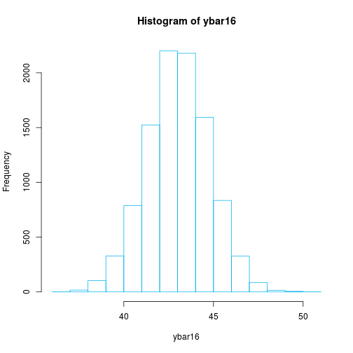

# Descrição:
Reexecute e explique os comandos R na 7a. ed. do livro texto na pagina 211.

# Desenvolvimento:
## Geração de números aleatórios:
Os próximos comandos mostram como gerar $1000$ num eros aleatórios com os inteiros $[0,1,..,9]$.

```r
y = c(0:9) #cria um vetor com os valores (0,1,2,...,9)
x = sample(y, 1000, replace=T) #cria uma amostra de tamanho 1000 com os valores
	#contidos no vetor y
x # exibe a amostra
```

```
##    [1] 7 8 5 7 3 3 7 4 3 2 2 4 1 0 0 1 7 8 6 4 3 8 3 5 2 6 0 7 1 6 0 0 5 4
##   [35] 9 7 1 7 5 2 9 7 1 6 0 6 9 9 0 6 2 6 6 3 2 4 4 6 3 3 1 5 2 6 6 9 5 4
##   [69] 3 2 9 9 4 9 7 3 7 5 3 5 3 4 1 3 3 7 7 7 8 3 1 9 9 6 9 9 3 7 5 0 7 7
##  [103] 7 7 1 3 1 3 0 4 7 5 6 5 6 4 5 6 7 7 0 8 7 4 6 2 7 9 4 7 6 5 0 4 4 3
##  [137] 2 5 0 3 2 6 3 1 3 1 1 8 0 2 5 0 4 7 1 8 0 7 2 8 0 5 2 5 0 0 6 2 4 3
##  [171] 8 8 3 5 8 5 8 5 6 6 5 9 7 9 4 3 5 5 7 2 4 7 8 4 2 5 5 3 1 3 0 2 0 9
##  [205] 5 6 1 9 1 8 6 3 8 5 8 6 9 3 9 7 1 6 8 8 7 3 7 2 0 9 1 3 3 8 9 1 3 3
##  [239] 4 8 7 8 4 6 7 1 1 5 7 2 9 0 1 0 3 7 4 7 7 7 9 9 1 2 6 0 4 1 9 7 5 1
##  [273] 2 1 8 9 6 0 1 8 0 6 2 7 2 3 5 9 6 1 5 2 1 2 6 5 5 8 6 5 5 6 3 1 8 7
##  [307] 6 2 3 5 5 3 8 1 9 3 7 0 1 8 7 0 9 3 5 6 7 4 8 8 9 0 8 3 2 4 0 8 3 9
##  [341] 3 0 2 4 0 6 1 3 7 6 6 5 8 0 4 4 2 7 1 6 3 7 7 0 8 9 3 9 5 9 4 7 6 0
##  [375] 4 8 9 9 7 9 6 2 3 1 3 0 7 7 1 1 4 3 9 7 9 3 8 0 7 4 5 5 0 9 1 1 6 6
##  [409] 7 1 0 9 5 3 1 4 6 5 1 7 1 6 0 1 9 0 3 6 5 9 0 8 4 3 3 2 8 0 9 0 6 4
##  [443] 1 6 4 0 4 4 7 6 5 2 3 4 1 8 0 7 7 3 2 8 6 5 5 7 5 9 3 3 3 1 4 1 2 8
##  [477] 2 8 9 9 6 6 6 5 3 4 4 7 0 8 1 1 0 1 2 4 0 4 5 6 3 0 9 7 3 7 5 2 5 4
##  [511] 7 7 2 0 2 1 6 5 7 9 3 9 8 9 1 6 4 7 1 5 6 2 9 3 8 1 9 7 0 8 4 9 6 1
##  [545] 5 1 4 5 4 4 4 8 7 5 4 8 1 0 6 8 6 8 7 8 3 9 3 4 9 9 7 1 4 7 0 4 7 9
##  [579] 0 7 8 7 1 2 9 6 6 9 4 3 0 3 0 2 5 2 3 0 6 5 5 2 4 6 4 1 8 5 1 1 7 0
##  [613] 1 7 4 1 3 7 0 6 2 6 2 6 3 6 9 1 1 8 8 4 6 7 4 6 8 9 3 2 2 2 0 0 4 4
##  [647] 5 0 5 6 2 0 6 5 5 0 9 3 6 0 8 4 1 6 9 5 3 3 1 0 6 8 4 8 4 2 1 3 7 6
##  [681] 8 4 2 9 7 6 7 4 0 4 7 2 9 9 7 9 8 3 4 3 7 6 2 0 4 1 8 1 0 1 9 5 3 2
##  [715] 3 4 0 0 0 2 7 5 9 2 2 2 0 0 3 3 7 8 2 9 0 0 4 7 8 1 7 9 3 3 9 4 0 9
##  [749] 4 0 4 9 7 1 9 2 9 7 4 1 5 9 9 6 3 6 3 0 2 9 8 3 2 9 6 7 5 4 1 0 3 3
##  [783] 8 8 6 4 0 3 8 9 7 1 8 2 4 4 9 9 2 1 5 4 0 2 4 9 2 4 9 8 0 2 9 4 2 9
##  [817] 1 8 1 8 7 3 9 4 6 8 0 8 9 4 2 8 8 6 9 1 2 3 8 5 8 9 4 8 8 1 6 7 9 2
##  [851] 3 3 6 5 4 5 1 2 7 9 0 8 5 8 9 3 3 6 0 6 0 9 6 8 0 5 5 3 6 5 3 5 2 4
##  [885] 9 9 9 8 9 6 6 2 7 8 0 4 2 1 9 0 8 4 3 4 6 3 4 7 4 0 7 7 5 5 3 4 9 1
##  [919] 4 4 6 3 2 3 9 6 4 2 9 6 8 7 4 3 5 5 3 3 3 3 4 1 4 7 2 3 0 3 2 1 8 6
##  [953] 8 5 8 1 1 8 3 2 8 6 0 5 7 6 3 3 0 7 4 2 3 3 8 7 6 7 1 5 3 7 7 2 3 6
##  [987] 0 2 8 8 9 3 5 2 4 7 8 3 9 7
```

## Calculando probabilidade binomial:
Os comandos a seguir mostram como calcular a probabilidade binomial quando $X$ esta em uma distribuição binomial com $n=10$ e $\pi=0,6$. 

```r
dbinom(3,10,.6) #calcula a probabilidade P(X=3)
```

```
## [1] 0.04246733
```

```r
pbinom(3,10,.6) #calcula a probabilidade P(X<=3)
```

```
## [1] 0.05476188
```

```r
# Calcula a probabilidade de P(X=k) para k = 0, 1, 2, ..., 10
k = c(0:10)
dbinom(k,10,.6)
```

```
##  [1] 0.0001048576 0.0015728640 0.0106168320 0.0424673280 0.1114767360
##  [6] 0.2006581248 0.2508226560 0.2149908480 0.1209323520 0.0403107840
## [11] 0.0060466176
```

## Calculando probabilidade de Poisson:
Os comandos a seguir mostram como calcular a probabilidade de Poisson quando $Y$ esta em uma distribuição binomial com $\lambda=10$ e $\pi=0,6$. 

```r
dbinom(3,10,.6) #calcula a probabilidade P(Y=3)
```

```
## [1] 0.04246733
```

```r
pbinom(3,10,.6) #calcula a probabilidade P(Y<=3)
```

```
## [1] 0.05476188
```

```r
# Calcula a probabilidade de P(Y=3)$ para k = 0, 1, 2, ..., 10
k = c(0:10)
dbinom(k,10,.6) #calcula a probabilidade P(X=3)
```

```
##  [1] 0.0001048576 0.0015728640 0.0106168320 0.0424673280 0.1114767360
##  [6] 0.2006581248 0.2508226560 0.2149908480 0.1209323520 0.0403107840
## [11] 0.0060466176
```

## Calculando probabilidade normal:
Os comandos a seguir mostram como calcular a probabilidade quando $X$ esta em uma distribuição normal com $\mu=23$ e $\sigma=5$. 

```r
pnorm(18,23,5) #calcula a probabilidade P(X<=18)
```

```
## [1] 0.1586553
```

```r
1-pnorm(18,23,5) #calcula a probabilidade P(X>18)
```

```
## [1] 0.8413447
```

```r
qnorm(.85,23,5) #calcula o 85o percentil
```

```
## [1] 28.18217
```

## Gerando uma amostra da distribuição média $\bar{y}$:
Os comandos em R a seguir simulam uma amostragem da distribuição da média $\bar{y}$. Serão gerados $10000$ valores para a média $\bar{y}$. Cada valor(dos $10000$) é gerado como sendo a média de uma amostra aleatória de tamanho $16$ de uma população com distribuição normal cuja média eh $\mu=43$ e $\sigma=7$. Posteriormente eh possível verificar os valores gerados, o histograma, a média e o desvio padrão dos $10000$ valores.

```r
r=10000
y=rep(0,16)
ybar16=rep(0,r)
for(i in 1:r){
	y = rnorm(16,43,7) #gera uma amostra normal de tamanho 16 da população
	ybar16[i] = mean(y) #calcula a média da amostra
}
head(ybar16) #exibe os primeiros elementos da amostra
```

```
## [1] 41.13765 43.60144 41.89670 45.42242 42.71432 42.61281
```

```r
hist(ybar16, border="deepskyblue2") #exibe o histograma da amostra
```



```r
mean(ybar16) #exibe a média da amostra
```

```
## [1] 42.99202
```

```r
sd(ybar16) #exibe o desvio padrão da amostra
```

```
## [1] 1.779419
```


## Gerando a plotagem do gráfico 4.28 do livro.

```r
y = c(133, 137, 148, 149, 152, 167, 174, 179, 189, 192, 201, 209, 210, 211, 218, 238, 245,
	248, 253, 257)
y=sort(y)
n=length(y)
i=1:n
u=(i-0.375)/(n+0.25)
x=qnorm(u)
plot(x,y,xlab="Normal quantiles", ylab="Cholesterol readings", lab=c(7,8,7), 
	ylim=c(100,280), main="Normal Reference Ditribution Plot\n Cholesterol readings",
	cex =.95, col="deepskyblue2")
abline(lm(y~x), col="deepskyblue2")
```


```r
cor(x,y) #calcula a correlação entre as variáveis
```

```
## [1] 0.9818437
```
